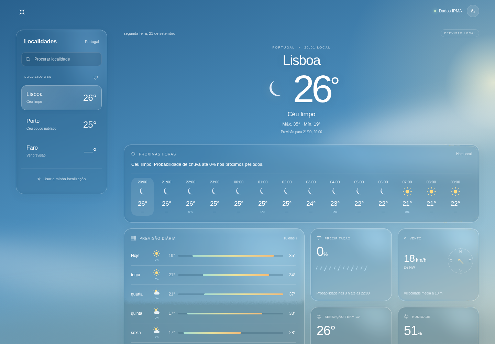
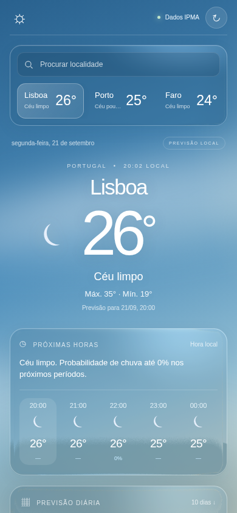

# IPMA Liquid Glass

A responsive weather page for Portugal using live [IPMA](https://www.ipma.pt/) forecasts and [liquidGL](https://github.com/naughtyduk/liquidGL) glass rendering. It has no accounts, tracking, API keys, external fonts or CDN scripts.

## Screenshots

### Desktop



### Mobile



## Features

- Hourly and ten-day forecasts for IPMA locations
- Search, geolocation and browser-local location selection
- Weather, rain, wind, humidity and feels-like details
- Fixed atmospheric background with GPU liquid-glass panels
- CSS fallback for unsupported GPUs and reduced-transparency preferences
- Responsive desktop and mobile layouts

## GitHub Pages

The app runs entirely in the browser and requests the three fixed IPMA HTTPS endpoints directly. The Pages workflow validates and publishes only `public/` from `main` under `/ipma-liquidglass/`.

For the first deployment, select **GitHub Actions** under **Settings → Pages → Build and deployment**. The resulting address is `https://fabianwgl.github.io/ipma-liquidglass/`.

No API key is required. Geolocation coordinates are used locally to select the nearest IPMA location and are neither sent nor stored; direct forecast requests still expose ordinary connection metadata to IPMA.

## Optional local/VPS server

```sh
cp .env.example .env
docker compose up -d --build
```

Open <http://localhost:8090>. The default binding is local-only. For remote access, keep that binding and publish it through an HTTPS reverse proxy; browser geolocation also requires a secure context. A direct `WEATHER_BIND=0.0.0.0` binding serves unencrypted HTTP and should only be used on a trusted network.

The container runs as a nonroot user with a read-only filesystem, dropped capabilities, resource limits and a health check. It serves the same client-only page and retains the normalized `/api/` endpoints for compatibility.

## Test

```sh
python3 -m unittest -v test_server.py
```

The server uses fixed IPMA endpoint families, bounded responses, caches and concurrency. The Pages workflow also checks the browser JavaScript, deployment file allowlist and project-subpath links before publishing.

## Data and attribution

Weather data comes from the public IPMA API. Forecasts are automated and may differ from forecasts prepared by meteorologists; consult official IPMA warnings when conditions matter.

liquidGL v2.2.4 is vendored under its MIT license. See [THIRD_PARTY.md](THIRD_PARTY.md).

This is an independent interface and is not an official IPMA or Apple product.
